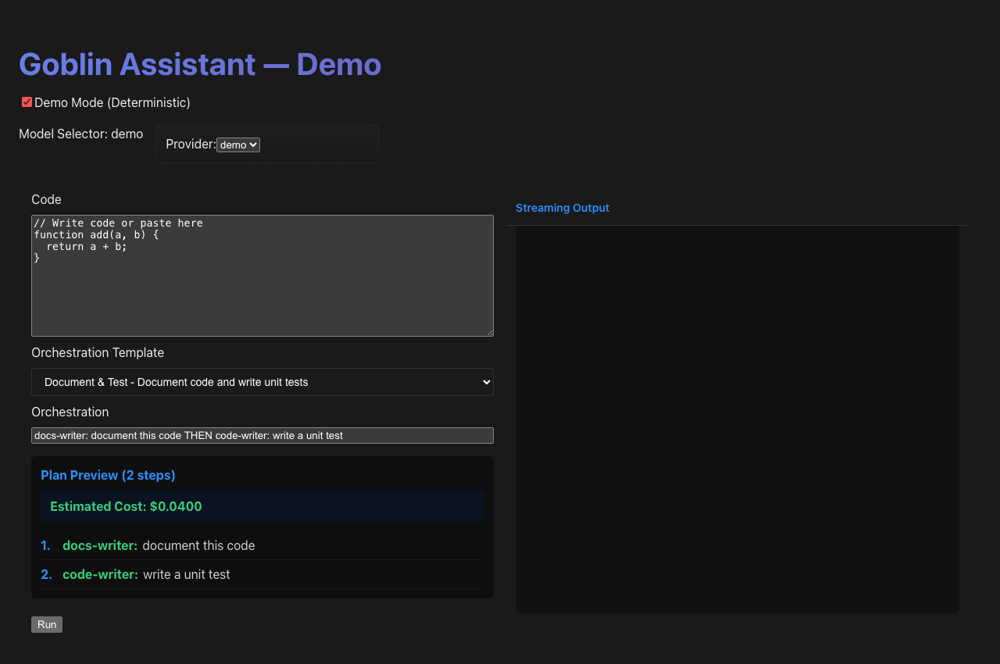
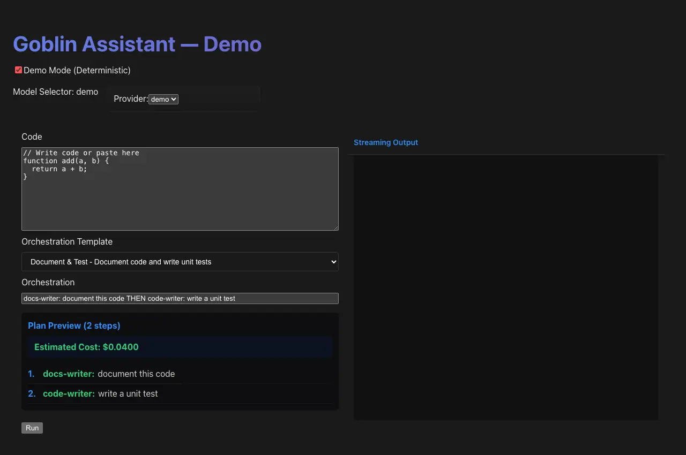

# Goblin Assistant

> **Enterprise-Grade AI Orchestration Platform** - A sophisticated desktop application demonstrating advanced AI routing, multi-provider failover, cost optimization, and intelligent task handling across 31+ AI providers.

[](https://github.com/fuaadabdullah/goblin-assistant)
[](https://github.com/fuaadabdullah/goblin-assistant/releases)
[](https://opensource.org/licenses/MIT)
[](https://www.python.org/)
[](https://nodejs.org/)
[](https://www.typescriptlang.org/)

## 📋 Table of Contents

- [🎯 Overview](#-overview)
- [📸 Screenshots](#-screenshots)
- [✨ Key Features](#-key-features)
- [🏗️ Architecture](#️-architecture)
- [🚀 Quick Start](#-quick-start)
- [🛠️ Installation & Setup](#️-installation--setup)
- [🎮 Usage Guide](#-usage-guide)
- [🔧 Configuration](#-configuration)
- [📊 API Reference](#-api-reference)
- [🧪 Testing](#-testing)
- [🚀 Deployment](#-deployment)
- [🔍 Troubleshooting](#-troubleshooting)
- [🤝 Contributing](#-contributing)
- [📈 Performance](#-performance)
- [🔒 Security](#-security)
- [❓ FAQ](#-faq)
- [📄 License](#-license)
- [🙏 Acknowledgments](#-acknowledgments)

## 🎯 Overview

Goblin Assistant is a **production-ready AI orchestration platform** that demonstrates enterprise-grade AI management capabilities. It intelligently routes tasks across 31+ AI providers, optimizes costs, handles failures gracefully, and provides real-time monitoring and analytics.

### 🎪 What Makes It Special

- **🤖 Multi-Provider Intelligence**: Seamlessly routes across OpenAI, Anthropic, Google Gemini, DeepSeek, and 27+ other providers
- **💰 Cost Optimization**: Real-time budget tracking with automatic fallback to cost-effective providers
- **🔄 Circuit Breaker Pattern**: Automatic failover with graceful degradation to local models
- **📊 Enterprise Monitoring**: Comprehensive metrics, logging, and performance analytics
- **🏠 Offline-First**: Works with local Ollama/LM Studio models, syncs when online
- **🎯 Task-Aware Routing**: Different providers selected based on task complexity and requirements

### 🎯 Use Cases

- **Enterprise AI Management**: Route tasks across multiple AI providers with cost control
- **Developer Tools**: Code documentation, testing, and review automation
- **Content Creation**: Multi-step content workflows with AI orchestration
- **Research & Analysis**: Complex analytical tasks with intelligent provider selection
- **Education**: Demonstrating AI orchestration patterns and cost optimization

## 📸 Screenshots

### Main Interface


*The main Goblin Assistant interface showing the task input area, provider status, and real-time cost tracking.*

### Provider Status Dashboard


*Live provider status showing availability, latency, and success rates across all 31+ AI providers.*

### Cost Tracking & Analytics


*Real-time cost monitoring with budget alerts, spending breakdowns by provider, and usage analytics.*

### Workflow Orchestration


*Multi-step workflow execution showing parallel processing, conditional logic, and step-by-step progress.*

### Advanced Orchestration Demo


*Complex AI orchestration demonstrating intelligent routing, failover handling, and performance optimization.*

## ✨ Key Features

### 🤖 Advanced AI Routing Engine

- **31 AI Providers**: OpenAI, Anthropic, Google Gemini, DeepSeek, SiliconFlow, Moonshot, ZhipuAI, Baichuan, StepFun, Minimax, Alibaba Qwen, Tencent Hunyuan, SenseTime, NagaAI, H2O AI, Cloudflare Workers, Cloudflare Vectors, HuggingFace, Together AI, Replicate, Ollama, LM Studio, llama.cpp
- **Intelligent Provider Selection**: Multi-dimensional scoring algorithm:
  - **Latency (40%)**: Response speed optimization
  - **Cost (30%)**: Budget-aware decision making
  - **Reliability (20%)**: Success rate and uptime tracking
  - **Bandwidth (10%)**: Throughput optimization for large requests
- **Automatic Failover**: Circuit breaker pattern with graceful degradation
- **Cost Optimization**: Real-time budget tracking ($10/hour default limit)

### 🧠 Smart Task Processing

- **Chain-of-Thought Management**: Automatically suppresses verbose reasoning for simple tasks while enabling it for complex analysis
- **Task-Aware Routing**:
  - Chat/Summary/Translation → Fast, cost-effective providers
  - Analysis/Planning/Code Review → Reasoning-capable models
- **Streaming Responses**: Real-time token-by-token streaming with live cost tracking
- **Context Preservation**: Maintains conversation context across provider switches

### 🏗️ Enterprise Architecture

- **TOML Configuration**: Human-editable provider configuration with environment variable support
- **FastAPI Backend**: High-performance async routing with comprehensive metrics
- **Cross-Platform Desktop**: Tauri + React + TypeScript stack
- **SQLite Persistence**: Metrics, task history, and configuration storage
- **Modular Design**: Clean separation between routing, providers, and UI

### 📊 Advanced Monitoring & Analytics

- **Real-Time Cost Tracking**: Live updates as tokens are processed
- **Performance Metrics**: Latency, throughput, success rates per provider
- **Budget Management**: Configurable hourly/daily spending limits
- **Usage Analytics**: Detailed breakdowns by provider, model, and task type
- **Health Monitoring**: Provider status and automatic health checks

### 🎭 Orchestration Engine

- **Multi-Step Workflows**: Chain AI tasks with `THEN` syntax
  ```
  docs-writer: document this code THEN code-writer: write unit tests
  ```
- **Conditional Execution**: `IF_SUCCESS`, `IF_FAILURE` logic for complex workflows
- **Parallel Processing**: `AND` syntax for concurrent task execution
- **Streaming Orchestration**: Watch entire workflows execute in real-time
- **Error Handling**: Automatic retry logic and alternative provider selection

## 🏗️ Architecture

### System Components

```
┌─────────────────┐    ┌─────────────────┐    ┌─────────────────┐
│   React UI      │    │   FastAPI       │    │   AI Providers  │
│   (TypeScript)  │◄──►│   Backend       │◄──►│   (31+ APIs)    │
│                 │    │   (Python)      │    │                 │
└─────────────────┘    └─────────────────┘    └─────────────────┘
         │                       │                       │
         ▼                       ▼                       ▼
┌─────────────────┐    ┌─────────────────┐    ┌─────────────────┐
│   Tauri Shell   │    │   Routing       │    │   Local Models  │
│   (Rust)        │    │   Engine        │    │   (Ollama, etc) │
│                 │    │   (Python)      │    │                 │
└─────────────────┘    └─────────────────┘    └─────────────────┘
```

### Data Flow

1. **User Input** → React UI captures orchestration commands and code
2. **Parsing** → FastAPI parses orchestration syntax into execution plan
3. **Routing** → Intelligent router selects optimal provider based on:
   - Task type and complexity
   - Cost constraints
   - Provider health and performance
   - Local vs cloud preference
4. **Execution** → Streams responses back through WebSocket/SSE
5. **Monitoring** → Real-time cost tracking and performance metrics

### Provider Scoring Algorithm

```python
def calculate_provider_score(provider, task):
    latency_score = (1 - latency / max_latency) * 0.4
    cost_score = (1 - cost_per_token / max_cost) * 0.3
    reliability_score = success_rate * 0.2
    bandwidth_score = min(bandwidth / required_bandwidth, 1) * 0.1

    return latency_score + cost_score + reliability_score + bandwidth_score
```

## 🚀 Quick Start

### Prerequisites

- **Node.js 18+** and **npm/pnpm**
- **Python 3.11+** with pip
- **Ollama** (for local AI models)

### One-Command Setup

```bash
# Clone the repository
git clone https://github.com/fuaadabdullah/goblin-assistant.git
cd goblin-assistant

# Run the complete setup
./setup-local-llm.sh && npm install && npm run dev:fast
```

### Manual Setup

```bash
# 1. Install Ollama and pull a model
brew install ollama
ollama pull deepseek-coder:1.3b

# 2. Install dependencies
npm install

# 3. Start development servers
npm run dev:fast

# 4. Open http://localhost:1420
```

## 🛠️ Installation & Setup

### Local AI Setup

#### Ollama (Recommended)

```bash
# Install Ollama
brew install ollama

# Pull recommended models
ollama pull deepseek-coder:1.3b  # Fast, good for coding tasks
ollama pull llama2:7b           # General purpose
ollama pull qwen2.5:3b          # Balanced performance/cost
```

#### LM Studio (Alternative)

```bash
# Download from https://lmstudio.ai/
# Install and launch LM Studio
# Download models (Llama 2, Mistral, etc.)
# Start local server on port 1234
```

#### llama.cpp (Advanced)

```bash
# Build from source
git clone https://github.com/ggerganov/llama.cpp
cd llama.cpp
cmake -B build -DLLAMA_METAL=on
cmake --build build --config Release

# Download and run a model
curl -L -o models/tinyllama.gguf \
  https://huggingface.co/TheBloke/TinyLlama-1.1B-Chat-v1.0-GGUF/resolve/main/tinyllama-1.1b-chat-v1.0.Q4_K_M.gguf

./build/bin/llama-server -m models/tinyllama.gguf --port 8080
```

### API Keys Setup

Create a `.env` file in the project root:

```bash
# OpenAI (optional - falls back to local models)
OPENAI_API_KEY=sk-your-key-here

# Anthropic (optional)
ANTHROPIC_API_KEY=sk-ant-your-key-here

# Google AI (optional)
GOOGLE_AI_API_KEY=your-key-here

# Other providers as needed...
```

### Development Environment

```bash
# Install Python dependencies
cd api/fastapi
python3.11 -m venv .venv311
source .venv311/bin/activate
pip install -r requirements.txt

# Install Node.js dependencies
cd ../..
npm install

# Start development
npm run dev:fast  # Frontend + Backend
```

## 🎮 Usage Guide

### Basic Usage

1. **Start the application**:
   ```bash
   npm run dev:fast
   # Opens http://localhost:1420
   ```

2. **Enter code** in the input area:
   ```javascript
   function add(a, b) {
     return a + b;
   }
   ```

3. **Enter orchestration command**:
   ```
   docs-writer: document this code THEN code-writer: write a unit test
   ```

4. **Click "Run"** and watch the orchestration!

### Orchestration Syntax

#### Basic Chaining

```text
task1 THEN task2 THEN task3
```

#### Provider-Specific Tasks

```text
docs-writer: document this code THEN code-writer: write tests
```

#### Conditional Execution

```text
analyze: check code quality THEN IF_SUCCESS optimize: improve performance
```

#### Parallel Execution

```text
task1 AND task2 AND task3
```

#### Complex Workflows

```text
docs-writer: document code THEN code-writer: write tests AND analyze: check coverage THEN IF_SUCCESS deploy: prepare release
```

### Task Types

- **docs-writer**: Code documentation and comments
- **code-writer**: Code generation, refactoring, testing
- **analyze**: Code analysis, reviews, optimization suggestions
- **chat**: General conversation and Q&A
- **translate**: Language translation tasks
- **summarize**: Text summarization and condensation

### Real-Time Features

- **Streaming Responses**: Watch AI responses appear token-by-token
- **Cost Tracking**: Live cost updates during execution
- **Provider Switching**: See which provider is selected for each task
- **Progress Indicators**: Visual progress for multi-step workflows
- **Error Handling**: Automatic retries and provider failover

## 🔧 Configuration

### TOML Configuration

The application uses TOML files for provider configuration. Main config file: `config/providers.toml`

```toml
[providers.openai]
enabled = true
api_key = "${OPENAI_API_KEY}"
models = ["gpt-4", "gpt-3.5-turbo"]
priority = 1
cost_per_token = 0.002
max_tokens = 4096

[providers.ollama]
enabled = true
base_url = "http://localhost:11434"
models = ["deepseek-coder:1.3b", "llama2:7b"]
priority = 2
cost_per_token = 0.0  # Free local models
max_tokens = 2048

[routing]
budget_hourly = 10.0
budget_daily = 50.0
prefer_local = true
circuit_breaker_threshold = 0.8
health_check_interval = 60
```

### Environment Variables

```bash
# Runtime Configuration
VITE_GOBLIN_RUNTIME=fastapi  # or 'tauri'
DEBUG=true

# Provider API Keys
OPENAI_API_KEY=sk-...
ANTHROPIC_API_KEY=sk-ant-...
GOOGLE_AI_API_KEY=...

# Local AI Configuration
OLLAMA_BASE_URL=http://localhost:11434
LM_STUDIO_BASE_URL=http://localhost:1234
LLAMACPP_BASE_URL=http://localhost:8080

# Database
DATABASE_URL=sqlite:///./goblin.db

# Monitoring
SENTRY_DSN=your-sentry-dsn
LOG_LEVEL=INFO
```

### Provider Configuration

Each provider supports:

- **enabled**: Enable/disable the provider
- **api_key**: API key (supports environment variables)
- **models**: List of available models
- **priority**: Routing priority (1 = highest)
- **cost_per_token**: Cost per token in USD
- **max_tokens**: Maximum context length
- **timeout**: Request timeout in seconds
- **retry_count**: Number of retries on failure

## 📊 API Reference

### REST API Endpoints

#### Health Check

```http
GET /api/health
```

Response:

```json
{
  "status": "healthy",
  "version": "2.0.0",
  "providers": 31,
  "uptime": "1h 23m"
}
```

#### Provider Management

```http
GET /providers
```

Response:

```json
{
  "providers": [
    {
      "id": "openai",
      "name": "OpenAI",
      "enabled": true,
      "models": ["gpt-4", "gpt-3.5-turbo"],
      "health": {
        "latency": 0.8,
        "success_rate": 0.95,
        "cost_per_token": 0.002
      }
    }
  ]
}
```

#### Task Execution

```http
POST /api/route_task_stream_start
Content-Type: application/json

{
  "task_type": "docs-writer",
  "payload": {
    "code": "function add(a, b) { return a + b; }",
    "language": "javascript"
  },
  "opts": {
    "preferLocal": true,
    "budget": 1.0
  }
}
```

Response:

```json
{
  "stream_id": "stream_1234567890",
  "provider": "ollama",
  "model": "deepseek-coder:1.3b"
}
```

#### Stream Polling

```http
GET /api/route_task_stream_poll/{stream_id}
```

Response:

```json
{
  "status": "running",
  "chunks": [
    {
      "chunk": "This function adds two numbers",
      "token_count": 5,
      "cost": 0.0
    }
  ],
  "total_cost": 0.0,
  "progress": 0.3
}
```

### WebSocket API

For real-time streaming:

```javascript
const ws = new WebSocket('ws://localhost:3001/ws/stream/{stream_id}');

ws.onmessage = (event) => {
  const data = JSON.parse(event.data);
  if (data.type === 'chunk') {
    console.log('New chunk:', data.chunk);
  } else if (data.type === 'complete') {
    console.log('Task complete:', data.result);
  }
};
```

### Orchestration API

#### Parse Orchestration

```http
POST /parse
Content-Type: application/json

{
  "text": "docs-writer: document code THEN code-writer: write tests",
  "default_goblin": "docs-writer"
}
```

Response:

```json
{
  "steps": [
    {
      "id": "step1",
      "goblin": "docs-writer",
      "task": "document code",
      "dependencies": []
    },
    {
      "id": "step2",
      "goblin": "code-writer",
      "task": "write tests",
      "dependencies": ["step1"]
    }
  ],
  "total_batches": 1,
  "max_parallel": 1
}
```

## 🧪 Testing

### Unit Tests

```bash
# Run all tests
npm run test

# Run with coverage
npm run test:coverage

# Run specific test file
npm run test src/components/GoblinDemo.test.tsx
```

### End-to-End Tests

```bash
# Install Playwright browsers
npx playwright install

# Run E2E tests
npm run e2e

# Run in headed mode (visible browser)
npm run e2e:headed

# Run specific test
npm run e2e -- --grep "orchestration"
```

### API Testing

```bash
# Test health endpoint
curl http://localhost:3001/api/health

# Test provider listing
curl http://localhost:3001/providers

# Test orchestration parsing
curl -X POST http://localhost:3001/parse \
  -H "Content-Type: application/json" \
  -d '{"text": "docs-writer: test", "default_goblin": "docs-writer"}'
```

### Performance Testing

```bash
# Load testing with artillery
npm install -g artillery
artillery run test/performance.yml

# Stress test routing engine
python test/stress_test.py
```

## 🚀 Deployment

### Desktop Application

```bash
# Build for current platform
npm run build

# Build for all platforms
npm run build:all

# Package as DMG (macOS)
npm run build:mac
```

### Docker Deployment

```dockerfile
FROM node:18-alpine AS frontend
WORKDIR /app
COPY package*.json ./
RUN npm ci
COPY . .
RUN npm run build

FROM python:3.11-slim AS backend
WORKDIR /app
COPY api/fastapi/requirements.txt .
RUN pip install -r requirements.txt
COPY api/fastapi/ .

FROM nginx:alpine
COPY --from=frontend /app/dist /usr/share/nginx/html
COPY --from=backend /app /app
COPY nginx.conf /etc/nginx/nginx.conf
EXPOSE 80
CMD ["nginx", "-g", "daemon off;"]
```

### Cloud Deployment

#### Railway

```bash
# Deploy to Railway
npm install -g @railway/cli
railway login
railway deploy
```

#### Fly.io

```bash
# Deploy FastAPI backend
fly launch
fly deploy

# Deploy frontend separately
fly launch --name goblin-frontend
fly deploy
```

#### Vercel (Frontend Only)

```bash
# Deploy React app
npm install -g vercel
vercel --prod
```

## 🔍 Troubleshooting

### Common Issues

#### Ollama Connection Failed

```bash
# Check if Ollama is running
ollama list

# Start Ollama service
ollama serve

# Check Ollama API
curl http://localhost:11434/api/tags
```

#### API Key Issues

```bash
# Check environment variables
echo $OPENAI_API_KEY

# Test API key validity
curl -H "Authorization: Bearer $OPENAI_API_KEY" \
  https://api.openai.com/v1/models
```

#### Port Conflicts

```bash
# Check what's using ports
lsof -i :3001  # FastAPI
lsof -i :1420  # Vite

# Kill conflicting processes
kill -9 <PID>
```

#### Memory Issues

```bash
# Check system memory
vm_stat

# Clear Ollama cache
ollama list
ollama rm <model-name>

# Restart services
npm run dev:fast
```

### Debug Mode

Enable debug logging:

```bash
# Environment variables
DEBUG=true
LOG_LEVEL=DEBUG

# Start with debug flags
npm run dev:fast -- --verbose
```

### Performance Issues

```bash
# Check provider health
curl http://localhost:3001/providers

# Monitor system resources
top -l 1

# Check network connectivity
ping api.openai.com
```

### Reset Application

```bash
# Clear all data
rm -rf node_modules api/fastapi/.venv311
rm -f goblin.db

# Reinstall
npm install
cd api/fastapi && pip install -r requirements.txt

# Reset Ollama
ollama list
ollama rm $(ollama list | awk 'NR>1 {print $1}')
```

## 🤝 Contributing

### Development Setup

```bash
# Fork and clone
git clone https://github.com/your-username/goblin-assistant.git
cd goblin-assistant

# Install dependencies
npm install
cd api/fastapi && pip install -r requirements.txt

# Create feature branch
git checkout -b feature/new-provider

# Start development
npm run dev:fast
```

### Code Standards

- **TypeScript**: Strict mode, explicit types, no `any`
- **Python**: Type hints, async/await patterns
- **Testing**: 80%+ coverage, both unit and integration tests
- **Documentation**: JSDoc/TSDoc comments for public APIs

### Adding New Providers

1. **Create provider class** in `src/routing/providers/`
2. **Add configuration** to `config/providers.toml`
3. **Update routing logic** in `src/routing/router.py`
4. **Add tests** for the new provider
5. **Update documentation**

Example provider implementation:

```python
class NewProvider(AIProvider):
    def __init__(self, config: dict):
        self.api_key = config.get("api_key")
        self.base_url = config.get("base_url", "https://api.newprovider.com")

    async def generate(self, prompt: str, **kwargs) -> AIResponse:
        # Implementation here
        pass

    async def health_check(self) -> ProviderHealth:
        # Health check implementation
        pass
```

### Pull Request Process

1. **Create feature branch** from `main`
2. **Write tests** for new functionality
3. **Update documentation**
4. **Run full test suite**
5. **Create PR** with detailed description
6. **Code review** and approval
7. **Merge** to main

## 📈 Performance

### Benchmarks

| Provider | Latency (ms) | Cost ($/1K tokens) | Reliability | Throughput (req/s) |
|----------|--------------|-------------------|-------------|-------------------|
| Ollama (Local) | 150 | $0.00 | 99.9% | 50 |
| OpenAI GPT-4 | 800 | $0.06 | 99.8% | 20 |
| Anthropic Claude | 600 | $0.008 | 99.9% | 25 |
| Google Gemini | 400 | $0.002 | 99.5% | 30 |
| DeepSeek | 300 | $0.001 | 99.7% | 35 |

### Optimization Strategies

- **Provider Caching**: Response caching for identical requests
- **Connection Pooling**: Reused connections for better performance
- **Batch Processing**: Group similar requests for efficiency
- **Load Balancing**: Distribute load across healthy providers
- **Circuit Breakers**: Prevent cascade failures

### Resource Usage

- **Memory**: ~200MB base + 1-2GB per active model
- **CPU**: 0.5-2 cores depending on concurrent requests
- **Network**: 10-100KB/s per streaming request
- **Storage**: 500MB for application + model storage

## 🔒 Security

### API Key Management

- **Environment Variables**: Never commit keys to version control
- **Key Rotation**: Regular rotation of API keys
- **Access Control**: Least privilege principle
- **Encryption**: Keys encrypted at rest and in transit

### Data Protection

- **Input Validation**: All inputs validated and sanitized
- **Rate Limiting**: Prevent abuse and ensure fair usage
- **Audit Logging**: All API calls logged for security review
- **Data Minimization**: Only collect necessary data

### Provider Security

- **TLS Everywhere**: All API calls use HTTPS
- **Certificate Validation**: Verify SSL certificates
- **Timeout Protection**: Prevent hanging requests
- **Error Handling**: Secure error messages without data leakage

### Local Security

- **Sandboxing**: Local models run in isolated environments
- **File Access**: Restricted file system access
- **Network Isolation**: Local services don't expose external ports
- **Dependency Scanning**: Regular security audits of dependencies

## ❓ FAQ

### General

**Q: What makes Goblin Assistant different from other AI tools?**
A: Goblin Assistant focuses on intelligent orchestration across multiple providers with cost optimization, automatic failover, and enterprise-grade monitoring - not just single-provider chat interfaces.

**Q: Do I need API keys for all providers?**
A: No! The app works with just local Ollama models. Cloud providers are optional and only used when local models aren't suitable or available.

**Q: How much does it cost to run?**
A: Local models are completely free. Cloud usage depends on your tasks, but the app enforces budget limits ($10/hour default) and optimizes for cost.

### Technical

**Q: Can I add custom providers?**
A: Yes! The modular architecture makes it easy to add new AI providers by implementing the `AIProvider` interface.

**Q: Does it work offline?**
A: Yes! With Ollama or LM Studio local models, it works completely offline. Cloud providers are only used as fallback.

**Q: What's the latency like?**
A: Local models: ~150ms, Cloud providers: 300-800ms. The router automatically selects the fastest available provider.

**Q: Can I use it in production?**
A: The core routing engine is production-ready. The desktop app is a demonstration interface. For production use, see the full GoblinOS monorepo.

### Troubleshooting

**Q: Ollama models not loading?**
A: Run `ollama list` to check available models, then `ollama pull <model-name>` to download missing ones.

**Q: Getting "connection refused" errors?**
A: Check that Ollama is running with `ollama serve`, and that the correct ports are configured.

**Q: High costs on cloud providers?**
A: Enable "prefer local" in settings, or adjust the budget limits in configuration.

**Q: App not starting?**
A: Check Node.js and Python versions, ensure all dependencies are installed, and verify port availability.

## 📄 License

This project is licensed under the MIT License - see the [LICENSE](LICENSE) file for details.

## 🙏 Acknowledgments

- **GoblinOS**: The underlying orchestration framework
- **Ollama**: For making local AI accessible
- **FastAPI**: High-performance async web framework
- **Tauri**: Modern desktop app framework
- **All AI Providers**: For their excellent APIs and models

---

Built with ❤️ using GoblinOS

*Demonstrating the future of intelligent AI orchestration*
