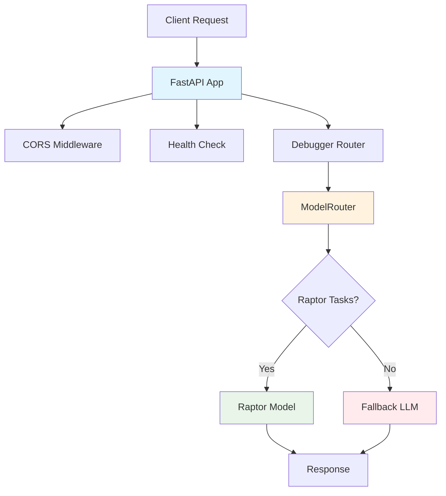

# GoblinOS Assistant

## Core Value

GoblinOS Assistant gives you a lean, powerful AI teammate for software tasks and everyday stuff — one that automatically picks the best LLM or AI provider for the job, balancing quality, cost, and speed.

### Core identity & tagline

GoblinOS is a multi-provider, privacy-first AI assistant platform that routes workloads across cloud and local models for maximum control and cost-efficiency. For a short, focused description of our architecture, characteristics, and target users, see `docs/CORE_IDENTITY.md`.

## Overview

GoblinOS Assistant is a comprehensive AI-powered development assistant with multiple components working together to provide intelligent software development support. It features intelligent model routing that automatically selects the most appropriate AI model based on task complexity, ensuring optimal performance and cost efficiency.
See `docs/ARCHITECTURE_OVERVIEW.md` for a compact architecture diagram and request flow.

## Quick Start

### Prerequisites

- Python 3.11+
- pip (Python package manager)

### Installation

1. **Clone the repository**:

   ```bash
   git clone https://github.com/fuaadabdullah/forgemono.git
   cd forgemono/apps/goblin-assistant
   ```

2. **Install dependencies**:

   ```bash
   pip install fastapi uvicorn httpx pytest
   ```

3. **Configure environment**:

   **Option A: Bitwarden Vault (Recommended)**

   ```bash
   # Install Bitwarden CLI
   npm install -g @bitwarden/cli

   # Login and setup vault (one-time)
   bw login YOUR_EMAIL
   export BW_SESSION=$(bw unlock --raw)

   # Load development secrets
   source scripts/load_env.sh

   # Verify secrets loaded
   echo $FASTAPI_SECRET
   ```

   See [Bitwarden Vault Setup](./docs/BITWARDEN_VAULT_SETUP.md) for complete vault configuration.

   **Option B: Manual .env (Development Only)**

   ```bash
   cp backend/.env.example backend/.env.local
   # Edit .env.local with your actual values
   ```

4. **Run the server**:

   ```bash
   uvicorn backend.main:app --reload --port 8000
   ```

5. **Verify installation**:

   ```bash
   curl http://localhost:8000/health
   ```

## Documentation

- **[Components](./docs/components.md)** - Detailed breakdown of all system components
- **[Features](./docs/features.md)** - Complete feature overview and capabilities
- **[Setup & Configuration](./docs/setup.md)** - Comprehensive setup and configuration guide
- **[Architecture](./docs/architecture.md)** - System architecture and design decisions
- **[Deployment](./docs/deployment.md)** - Deployment guides and production setup
- **[Contributing](./docs/contributing.md)** - Contribution guidelines and development workflow
- **[Troubleshooting](./docs/troubleshooting.md)** - Common issues and solutions

## Related Documentation

- [ForgeMonorepo Documentation](../../docs/README.md) - Overall project structure
- [Backend Documentation](./backend/docs/) - Backend-specific documentation
- [API Documentation](./docs/setup.md#api-documentation) - Complete API reference

## Development

### Project Structure

```text
apps/goblin-assistant/
├── api/
│   ├── core/
│   │   └── router.py          # Model routing core logic (NEW)
│   ├── routes/
│   │   ├── debug.py           # Model-based debug suggestions endpoint (NEW)
│   │   ├── privacy.py         # Privacy/GDPR features
│   │   └── routing_analytics.py
│   ├── debugger/
│   │   ├── model_router.py    # ⚠️  DEPRECATED - compatibility shim, use api.core.router
│   │   └── router.py          # ⚠️  DEPRECATED - compatibility shim, use api.routes.debug
│   ├── observability/
│   │   └── debug_router.py    # Observability & diagnostic surfaces
│   ├── main.py                # FastAPI application setup
│   └── .env.example           # Environment configuration template
├── tests/
│   └── test_model_router.py   # Unit tests for model routing
├── test_debugger.py           # Integration test script (endpoint: POST /debug/suggest)
└── README_DEBUGGER.md         # Detailed debugger/model-suggestion documentation
```

**Architecture Note**: Model routing logic has been decoupled from debugger concerns:
- **Core logic** (`api/core/router.py`): Task classification, model selection, provider invocation
- **Route handler** (`api/routes/debug.py`): HTTP endpoint for suggestions (`POST /debug/suggest`)
- **Legacy location** (`api/debugger/*`): Now compatibility shims pointing to new canonical locations (will be removed after one release cycle)

### Running Tests

GoblinOS Assistant features comprehensive test coverage across frontend and backend with meaningful tests that validate core functionality (auth, chat flows, provider routing, privacy).

#### Frontend Unit Tests (Vitest)

```bash
# Run all frontend tests (14+ tests)
npm run test:unit

# Run tests in watch mode (auto-rerun on changes)
npm run test:unit:watch

# Run with coverage report (generates HTML report)
npm run test:coverage
```

**Coverage Target**: 80% across statements, branches, functions, and lines

#### Backend Unit Tests (pytest)

```bash
# Run all backend tests with verbose output
cd api && python3 -m pytest tests/ -v

# Run specific test suite
python3 -m pytest tests/test_auth_comprehensive.py -v

# Run with coverage report
python3 -m pytest --cov=. --cov-report=html --cov-report=term-missing

# Run sanitization/PII detection tests
python3 -m pytest tests/test_sanitization_comprehensive.py -v
```

#### E2E Tests (Playwright)

```bash
# Run all E2E tests (requires server running on port 3000)
npm run test:e2e

# Run specific E2E suite
npm run test:e2e -- e2e/auth.spec.ts
```

#### All Tests Combined

```bash
# Run full test suite
npm run test:unit && cd api && python3 -m pytest tests/ -v && npm run test:e2e
```

**See [TESTING.md](./TESTING.md) for detailed testing guidelines, best practices, and troubleshooting.**

### Development Server

```bash
# Backend - With auto-reload for development
uvicorn backend.main:app --reload --port 8000

# Backend - Production deployment
uvicorn backend.main:app --host 0.0.0.0 --port 8000
```

## Testing Strategy

GoblinOS Assistant uses a multi-layer testing approach to ensure reliability:

### Test Coverage

**Frontend** (React/Next.js)
- Component tests: ModularLoginForm, auth flows, UI behavior
- Framework: Vitest + React Testing Library
- API mocking: Mock Service Worker (MSW)
- Target coverage: 80%
- Status: 14 tests passing ✅

**Backend** (FastAPI)
- Auth tests: JWT tokens, CSRF protection, rate limiting, password hashing
- Sanitization tests: PII detection (email, phone, SSN, credit cards, api keys), sensitive keywords
- Framework: pytest with pytest-cov
- Target coverage: 70% baseline, 80% target
- Status: 17 core logic tests passing ✅

**E2E Tests** (Playwright)
- Auth flows: Login, registration
- Chat interface: Message sending, history
- Privacy: PII masking, header security, data deletion

### Test Infrastructure

- **Vitest Config**: `vitest.config.ts` - 80% coverage thresholds
- **Coverage Config**: `.coveragerc` - Coverage reporting for backend
- **Test Mocking**: `src/test/setup.ts` - Global test utilities, mocks, MSW
- **API Mocks**: `src/test/mswServer.ts` - Centralized API handlers
- **Pytest Config**: `api/pytest.ini` - Backend test configuration

### Running Tests

```bash
# Frontend tests (watch mode)
npm run test:unit:watch

# Frontend with coverage
npm run test:coverage

# Backend comprehensive tests
cd api && python3 -m pytest tests/ -v

# Backend with coverage report
cd api && python3 -m pytest --cov=. --cov-report=html --cov-report=term-missing

# E2E tests (requires running server)
npm run test:e2e
```

**See [TESTING.md](./TESTING.md) for detailed guidelines.**


### Frontend Development

The frontend is built with Next.js 14.2.15 (App Router) + TypeScript.

```bash
# Install dependencies
pnpm install

# Start development server with hot reloading
pnpm dev

# Build for production
pnpm build

# Start production server
pnpm start

# Run Storybook (component development)
pnpm storybook
```

**Migration Notes**: The frontend was recently migrated from Vite to Next.js. All pages are now located in the `app/` directory using Next.js App Router. The development server provides hot reloading and all modern Next.js features.

## Architecture


```mermaid
graph TB
    A[Client Request] --> B[FastAPI App]
    B --> C[CORS Middleware]
    B --> D[Health Check]
    B --> E[Debugger Router]

    E --> F[ModelRouter]
    F --> G{Raptor Tasks?}
    G -->|Yes| H[Raptor Model]
    G -->|No| I[Fallback LLM]

    H --> J[Response]
    I --> J

    style B fill:#e1f5fe
    style F fill:#fff3e0
    style H fill:#e8f5e8
    style I fill:#ffebee
```

### Key Components

- **FastAPI Application**: Main web framework handling HTTP requests
- **ModelRouter**: Intelligent routing logic based on task type and complexity
- **Debugger Router**: Specialized endpoints for debugging assistance
- **Environment Config**: Secure credential and endpoint management

## Migration to Next.js

The frontend was recently migrated from Vite + React Router to Next.js 14.2.15 with App Router. Key changes:

### What Changed
- **Framework**: Vite → Next.js App Router
- **Routing**: React Router → Next.js file-based routing (`app/` directory)
- **Pages**: `src/pages/` → `app/` routes
- **Environment Variables**: `VITE_*` → `NEXT_PUBLIC_*`
- **Build System**: Vite → Next.js with Turbopack
- **Storybook**: `@storybook/react-vite` → `@storybook/nextjs`

### File Structure
```
app/
├── layout.tsx          # Root layout
├── page.tsx           # Home page (/)
├── dashboard/
│   └── page.tsx       # /dashboard
├── chat/
│   └── page.tsx       # /chat
├── login/
│   └── page.tsx       # /login
└── ...
src/
├── components/        # Shared components
├── hooks/            # React hooks
├── store/            # State management
└── ...
```

### Development Commands
```bash
# Development (replaces npm run dev)
pnpm dev

# Build (replaces npm run build)
pnpm build

# Storybook (updated framework)
pnpm storybook
```

### Migration Notes
- All pages now use `'use client'` directive for client components
- Navigation uses `useRouter` from `next/navigation` instead of `useNavigate`
- Search params use `useSearchParams` instead of `useSearchParams` from React Router
- Environment variables changed from `VITE_*` to `NEXT_PUBLIC_*`
- Import paths adjusted to `../../src/` from app routes

## Deployment

### Production Pipeline (Recommended)

The **villain-level production pipeline** combines Bitwarden CLI, CircleCI, and Fly.io for automated, secure deployments:

- **Bitwarden Vault**: All secrets stored securely
- **CircleCI**: Automated CI/CD on every push to main
- **Fly.io**: Production hosting with zero-downtime deploys

**Setup**: See [Production Pipeline Guide](./docs/PRODUCTION_PIPELINE.md)

**Quick Deploy**: Push to `main` branch → Automatic production deployment

### Manual Deployment Options

#### Fly.io Manual Deploy

For testing or emergency deployments:

```bash

# Load production secrets from Bitwarden
source scripts/load_env.sh

# Deploy to Fly.io
./deploy-fly.sh
```

#### Local Development

```bash
# Install dependencies
pip install -r requirements.txt

# Run with uvicorn
uvicorn backend.main:app --reload
```

#### Docker Deployment

```dockerfile

FROM python:3.11-slim

WORKDIR /app
COPY requirements.txt .
RUN pip install -r requirements.txt

COPY . .
EXPOSE 8000

CMD ["uvicorn", "backend.main:app", "--host", "0.0.0.0", "--port", "8000"]
```

### Production Considerations

- Use a reverse proxy (nginx/Caddy) for SSL termination
- Implement rate limiting and request throttling
- Set up monitoring and logging
- Use environment-specific configuration
- Consider container orchestration (Docker Compose/Kubernetes)

## Contributing

### Development Guidelines

1. Follow PEP 8 style guidelines
2. Write comprehensive unit tests
3. Update documentation for API changes
4. Use meaningful commit messages
5. Test integration endpoints thoroughly

### Adding New Features

1. Create feature branch from `main`
2. Implement changes with tests
3. Update relevant documentation
4. Submit pull request with description

## Troubleshooting

### Common Issues

**Import Errors**: Ensure you're running from the correct directory:

```bash
cd apps/goblin-assistant
```

**Environment Variables**: Verify `.env.local` exists and contains valid keys:

```bash

ls -la backend/.env.local
```

**Port Conflicts**: Change the default port if 8000 is in use:

```bash
uvicorn backend.main:app --port 8001
```

### Debug Mode

Enable detailed logging:

```bash

export PYTHONPATH=/Users/fuaadabdullah/ForgeMonorepo/apps/goblin-assistant
python -c "import logging; logging.basicConfig(level=logging.DEBUG)"
```

## Related Documentation

- [Debugger API Documentation](./README_DEBUGGER.md) - Detailed debugger endpoint specifications
- [ForgeMonorepo Documentation](../../docs/README.md) - Overall project structure
- [GoblinOS Guilds](../../GoblinOS/docs/ROLES.md) - Team roles and responsibilities

## License

This project is part of the ForgeMonorepo and follows the same licensing terms.

## Support

For issues and questions:

1. Check existing documentation
2. Review test cases for usage examples
3. Create an issue in the ForgeMonorepo repository
4. Contact the development team through GoblinOS channels

---

**Last Updated**: November 25, 2025
**Version**: 1.0.0
