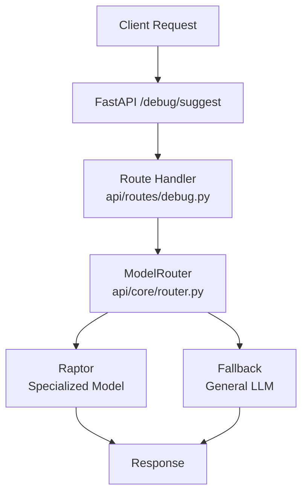

# GoblinOS Assistant Model-Based Debug Suggestions

This module provides AI-powered debugging assistance for the GoblinOS Assistant, featuring intelligent model routing between Raptor (for quick tasks) and fallback LLMs (for complex reasoning).

## Architecture Overview

The model routing logic has been refactored to clarify domain separation:

- **Core Logic** (`api/core/router.py`): Model selection and invocation
- **Route Handler** (`api/routes/debug.py`): HTTP endpoint and request validation
- **Deprecated** (`api/debugger/*`): Compatibility shims (will be removed after one release)

## Features

- **Smart Model Routing**: Automatically routes debug tasks to the most appropriate AI model
- **Low-Latency Responses**: Raptor handles quick, routine debugging tasks
- **Fallback Support**: Complex tasks route to more capable LLMs
- **Structured Responses**: Consistent API responses with model metadata

## Supported Tasks

### Raptor Tasks (Fast Path)

- `summarize_trace` - Summarize error stack traces
- `quick_fix` - Suggest simple code fixes
- `unit_test_hint` - Generate unit test suggestions
- `infer_function_name` - Suggest function names from code

### Fallback Tasks (Complex Reasoning)

- `refactor_suggestion` - Complex code refactoring
- `architecture_review` - System design feedback
- All other custom tasks

## API Usage

### Endpoint

```http
POST /debug/suggest
```

**Note**: Legacy endpoint `/debugger/suggest` is DEPRECATED but currently aliased for backward compatibility.

### Request Format

```json
{
  "task": "quick_fix",
  "context": {
    "error": "ValueError: division by zero",
    "code": "result = 10 / 0",
    "language": "python"
  }
}
```

### Response Format

```json
{
  "model": "raptor",
  "suggestion": "Add a check to ensure divisor is not zero before division",
  "confidence": 0.85,
  "task": "quick_fix",
  "timestamp": "2025-11-25",
  "raw": { ... }
}
```

## Configuration

Set these environment variables in `.env.local`:

```bash

# Raptor model (for quick tasks)
RAPTOR_URL=https://your-raptor-endpoint/api
RAPTOR_API_KEY=your-raptor-key

# Fallback model (for complex tasks)
FALLBACK_MODEL_URL=https://your-llm-endpoint/api
FALLBACK_MODEL_KEY=your-llm-key
```

## Local Development

1. Install dependencies:

   ```bash
   pip install fastapi uvicorn httpx
   ```

2. Set environment variables in `.env.local`

3. Run the server:

   ```bash
   cd apps/goblin-assistant
   uvicorn api.main:app --reload --port 8000
   ```

4. Test the endpoint:

   ```bash
   cd apps/goblin-assistant
   python test_debugger.py
   ```

## Testing

### Unit Tests (Model Routing Logic)

```bash
cd apps/goblin-assistant
python -m pytest tests/test_model_router.py -v
```

Tests import from canonical location: `api.core.router`

### Integration Tests (HTTP Endpoint)

```bash
cd apps/goblin-assistant
python test_debugger.py
```

Targets endpoint: `POST /debug/suggest`

## Architecture



## Module Structure

**`api/core/router.py`** (Canonical location)
- `RAPTOR_TASKS` - Task classification constant
- `ModelRoute` - Config dataclass for endpoint routing
- `ModelRouter` - Core routing logic

**`api/routes/debug.py`** (Canonical location)
- `router` - FastAPI APIRouter with `/debug/suggest` endpoint

**`api/debugger/*`** (DEPRECATED — Compatibility shims only)
- Will be removed after one release cycle
- New code should import from `api.core` and `api.routes`

## Migration Guide

If you have code importing from old locations, update as follows:

**Old (Deprecated)**
```python
from api.debugger.model_router import ModelRouter
from api.debugger.router import router as debug_router
```

**New (Canonical)**
```python
from api.core.router import ModelRouter
from api.routes.debug import router as debug_router
```

Both will work during compatibility window, but new code must use canonical locations.

## Security Notes

- Never commit API keys to version control
- Use environment variables for all secrets
- Consider rate limiting for production deployment
- Log model usage for monitoring (anonymized)

## Future Enhancements

- Add confidence thresholds for automatic acceptance
- Implement caching for repeated queries
- Add telemetry for model performance tracking
- Support for custom model routing rules
- Remove compatibility shims after one release cycle
