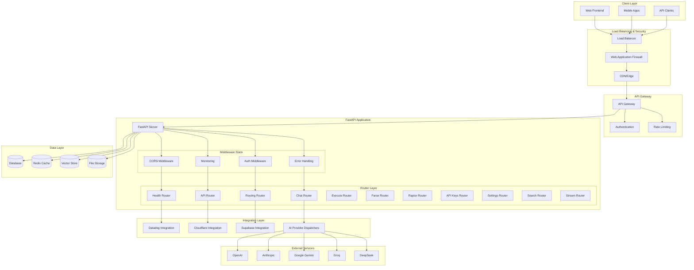
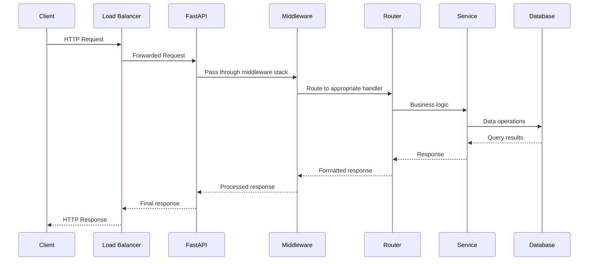
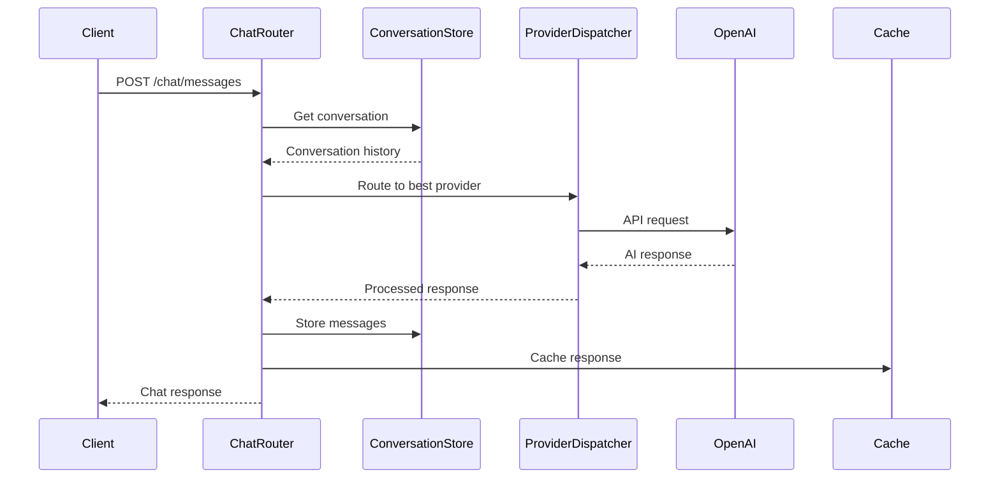
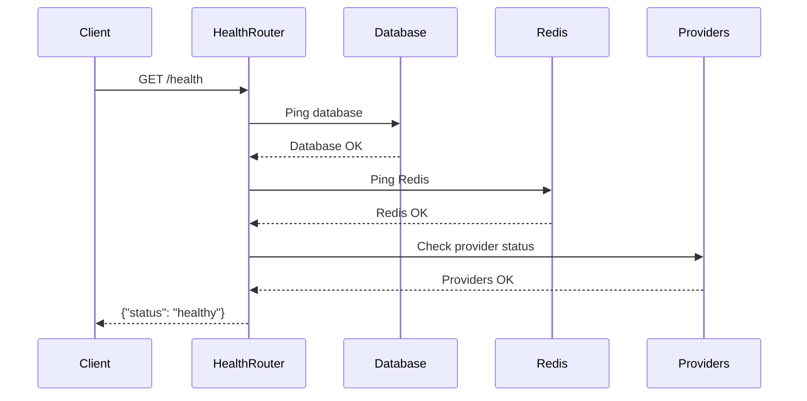
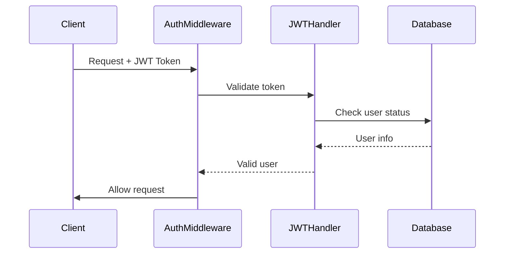

# System Architecture

This document provides a comprehensive overview of the Goblin Assistant Backend system architecture, design patterns, and implementation details.

## Overview

The Goblin Assistant Backend is built using a modular, microservices-inspired architecture on top of FastAPI. The system is designed for scalability, maintainability, and cost-efficiency through intelligent AI provider routing and comprehensive monitoring.

## High-Level Architecture



## Core Components

### FastAPI Application Layer

The core of the system is a FastAPI application that serves as the API gateway and request router.

#### Application Initialization (`main.py`)

```python
from fastapi import FastAPI
from fastapi.middleware.cors import CORSMiddleware

# Import all routers
from api.api_router import router as api_router
from api.routing_router import router as routing_router
# ... other imports

app = FastAPI(
    title="Goblin Assistant API",
    description="AI-powered development assistant with multi-provider routing",
    version="1.0.0",
)

# Add middleware
app.add_middleware(ErrorHandlingMiddleware)
app.add_middleware(
    CORSMiddleware,
    allow_origins=["*"],
    allow_credentials=True,
    allow_methods=["*"],
    allow_headers=["*"],
)

# Include routers
app.include_router(api_router)
app.include_router(routing_router)
# ... other routers
```

#### Startup and Shutdown Events

```python
@app.on_event("startup")
async def startup_event():
    """Initialize resources on startup"""
    await cache.init_redis()
    await init_db()
    await monitor.start()

@app.on_event("shutdown")
async def shutdown_event():
    """Clean up resources on shutdown"""
    await monitor.stop()
    await cache.close()
```

### Middleware Stack

The middleware stack provides cross-cutting concerns like security, monitoring, and error handling.

#### Error Handling Middleware (`middleware.py`)

```python
class ErrorHandlingMiddleware(BaseHTTPMiddleware):
    async def dispatch(self, request: Request, call_next):
        try:
            response = await call_next(request)
            return response
        except Exception as e:
            # Log error
            logger.error(f"Unhandled error: {e}")
            
            # Return formatted error response
            return JSONResponse(
                status_code=500,
                content={
                    "error": {
                        "code": "INTERNAL_ERROR",
                        "message": "An internal error occurred"
                    }
                }
            )
```

#### Monitoring Middleware (`monitoring.py`)

```python
class ProviderMonitor:
    async def start(self):
        """Start background monitoring tasks"""
        asyncio.create_task(self._monitor_loop())
    
    async def _monitor_loop(self):
        """Continuous monitoring of provider health"""
        while True:
            await self._check_providers()
            await asyncio.sleep(60)  # Check every minute
```

### Router Architecture

The API is organized into specialized routers, each handling a specific domain of functionality.

#### Health Router (`health.py`)

Provides comprehensive system health monitoring:

```python
@router.get("/health")
async def health_check():
    """Basic health check endpoint"""
    return {"status": "healthy"}

@router.get("/v1/health/")
async def comprehensive_health():
    """Detailed health check with component status"""
    return {
        "status": "healthy",
        "components": {
            "database": await check_db_health(),
            "redis": await check_redis_health(),
            "providers": await check_providers_health()
        }
    }
```

#### Chat Router (`chat_router.py`)

Handles conversation management and AI chat:

```python
@router.post("/chat/conversations")
async def create_conversation(request: CreateConversationRequest):
    """Create a new conversation"""
    conversation = await conversation_store.create_conversation(
        user_id=request.user_id,
        title=request.title
    )
    return conversation

@router.post("/chat/conversations/{conversation_id}/messages")
async def send_message(conversation_id: str, request: SendMessageRequest):
    """Send a message and get AI response"""
    # Get conversation history
    conversation = await conversation_store.get_conversation(conversation_id)
    
    # Get AI response using provider dispatcher
    response = await invoke_provider(
        provider=request.provider,
        model=request.model,
        messages=conversation.messages
    )
    
    # Store response and return
    await conversation_store.add_message_to_conversation(...)
    return response
```

#### Routing Router (`routing_router.py`)

Manages intelligent AI provider routing:

```python
@router.get("/routing/providers")
async def get_available_providers():
    """Get list of configured providers"""
    return top_providers_for("chat")

@router.post("/routing/route")
async def route_request(request: RouteRequest):
    """Route request to best provider"""
    result = await route_task(
        task_type=request.task_type,
        payload=request.payload,
        prefer_local=request.prefer_local,
        prefer_cost=request.prefer_cost
    )
    return result
```

### Integration Layer

#### Datadog Integration (`datadog_integration.py`)

Provides comprehensive monitoring and metrics:

```python
class DatadogProviderMonitor:
    def track_provider_request(self, provider: str, duration: float, success: bool):
        """Track provider request metrics"""
        # Send metrics to Datadog
        pass
    
    def track_conversation_metrics(self, action: str, user_id: str):
        """Track conversation analytics"""
        # Track user engagement metrics
        pass
```

#### Cloudflare Integration (`cloudflare_integration.py`)

Edge computing and security features:

```python
class CloudflareSecurityMiddleware(BaseHTTPMiddleware):
    async def dispatch(self, request: Request, call_next):
        """Security middleware for edge protection"""
        # Validate Cloudflare security headers
        # Rate limiting
        # Bot detection
        pass
```

#### Supabase Integration (`supabase_integration.py`)

Database and authentication services:

```python
class SupabaseAuth:
    async def create_user(self, email: str, password: str):
        """Create user with Supabase Auth"""
        # Use Supabase client for user management
        pass
    
    async def verify_jwt_token(self, token: str):
        """Verify JWT token"""
        # Validate with Supabase
        pass
```

### Data Layer

#### Database Configuration

The system supports both SQLite (development) and PostgreSQL (production):

```python
# Database initialization
async def init_db():
    """Initialize database tables"""
    engine = create_async_engine(DATABASE_URL)
    async with engine.begin() as conn:
        await conn.run_sync(Base.metadata.create_all)
```

#### Redis Cache

Redis provides caching and session management:

```python
class CacheManager:
    async def init_redis(self):
        """Initialize Redis connection"""
        self.redis = await aioredis.from_url(REDIS_URL)
    
    async def get(self, key: str):
        """Get value from cache"""
        return await self.redis.get(key)
    
    async def set(self, key: str, value: str, expire: int = 3600):
        """Set value in cache"""
        await self.redis.setex(key, expire, value)
```

#### Vector Store (ChromaDB)

For semantic search and RAG capabilities:

```python
import chromadb

class VectorStore:
    def __init__(self):
        self.client = chromadb.Client()
        self.collection = self.client.create_collection("documents")
    
    async def add_document(self, text: str, metadata: dict):
        """Add document to vector store"""
        self.collection.add(
            documents=[text],
            metadatas=[metadata],
            ids=[str(uuid.uuid4())]
        )
    
    async def search(self, query: str, limit: int = 5):
        """Search similar documents"""
        return self.collection.query(
            query_texts=[query],
            n_results=limit
        )
```

## Request Flow

### 1. Request Reception



### 2. Chat Request Flow



### 3. Health Check Flow



## Data Flow Patterns

### 1. Provider Routing Pattern

The system uses intelligent routing to select the best AI provider:

```python
class ProviderRouter:
    def __init__(self):
        self.providers = {
            "openai": OpenAIProvider(),
            "anthropic": AnthropicProvider(),
            "gemini": GeminiProvider()
        }
    
    async def route_request(self, task_type: str, requirements: dict):
        """Route request to optimal provider"""
        # Analyze requirements
        cost_budget = requirements.get("cost_budget", 1.0)
        latency_requirement = requirements.get("max_latency", 5.0)
        quality_requirement = requirements.get("min_quality", 0.8)
        
        # Score providers
        scores = {}
        for name, provider in self.providers.items():
            if await provider.is_available():
                score = self.calculate_score(provider, cost_budget, latency_requirement, quality_requirement)
                scores[name] = score
        
        # Select best provider
        best_provider = max(scores, key=scores.get)
        return self.providers[best_provider]
```

### 2. Circuit Breaker Pattern

Protects against provider failures:

```python
class CircuitBreaker:
    def __init__(self, failure_threshold=5, recovery_timeout=60):
        self.failure_threshold = failure_threshold
        self.recovery_timeout = recovery_timeout
        self.failure_count = 0
        self.last_failure_time = None
        self.state = "CLOSED"  # CLOSED, OPEN, HALF_OPEN
    
    async def call(self, func, *args, **kwargs):
        if self.state == "OPEN":
            if time.time() - self.last_failure_time > self.recovery_timeout:
                self.state = "HALF_OPEN"
            else:
                raise Exception("Circuit breaker is OPEN")
        
        try:
            result = await func(*args, **kwargs)
            if self.state == "HALF_OPEN":
                self.state = "CLOSED"
                self.failure_count = 0
            return result
        except Exception as e:
            self.failure_count += 1
            self.last_failure_time = time.time()
            
            if self.failure_count >= self.failure_threshold:
                self.state = "OPEN"
            
            raise e
```

### 3. Cache Aside Pattern

Improves performance through caching:

```python
class CacheAside:
    def __init__(self, redis_client, database):
        self.redis = redis_client
        self.db = database
    
    async def get_user_conversations(self, user_id: str):
        """Get user conversations with caching"""
        cache_key = f"conversations:{user_id}"
        
        # Try cache first
 cached_data = await self.redis.get(cache_key)
        if cached_data:
            return json.loads(cached_data)
        
        # Cache miss - fetch from database
        conversations = await self.db.get_user_conversations(user_id)
        
        # Store in cache with 1-hour TTL
        await self.redis.setex(cache_key, 3600, json.dumps(conversations))
        
        return conversations
```

## Security Architecture

### Authentication Flow



### API Key Encryption

Provider API keys are encrypted at rest:

```python
from cryptography.fernet import Fernet

class EncryptionManager:
    def __init__(self, key: bytes):
        self.cipher = Fernet(key)
    
    def encrypt_api_key(self, api_key: str) -> str:
        """Encrypt API key for storage"""
        return self.cipher.encrypt(api_key.encode()).decode()
    
    def decrypt_api_key(self, encrypted_key: str) -> str:
        """Decrypt API key for use"""
        return self.cipher.decrypt(encrypted_key.encode()).decode()
```

### Rate Limiting

Implements token bucket algorithm:

```python
class RateLimiter:
    def __init__(self, capacity: int, refill_rate: float):
        self.capacity = capacity
        self.refill_rate = refill_rate
        self.tokens = capacity
        self.last_refill = time.time()
    
    async def allow_request(self, cost: int = 1) -> bool:
        """Check if request is allowed"""
        now = time.time()
        
        # Refill tokens
        time_passed = now - self.last_refill
        self.tokens = min(
            self.capacity,
            self.tokens + time_passed * self.refill_rate
        )
        self.last_refill = now
        
        # Check if enough tokens
        if self.tokens >= cost:
            self.tokens -= cost
            return True
        return False
```

## Performance Architecture

### Async Processing

The system uses async/await for all I/O operations:

```python
async def process_multiple_requests(requests: List[Request]):
    """Process multiple requests concurrently"""
    tasks = [process_single_request(req) for req in requests]
    results = await asyncio.gather(*tasks, return_exceptions=True)
    return results

async def process_single_request(request: Request):
    """Process single request with async operations"""
    # Async database query
    user = await database.get_user(request.user_id)
    
    # Async provider call
    ai_response = await ai_provider.generate_response(
        prompt=request.prompt,
        model=request.model
    )
    
    # Async cache update
    await cache.set(f"response:{request.id}", ai_response)
    
    return ai_response
```

### Connection Pooling

Database and HTTP connections are pooled:

```python
# Database connection pool
engine = create_async_engine(
    DATABASE_URL,
    pool_size=20,
    max_overflow=30,
    pool_pre_ping=True,
    pool_recycle=3600
)

# HTTP client pool
httpx_client = httpx.AsyncClient(
    limits=httpx.Limits(
        max_keepalive_connections=20,
        max_connections
