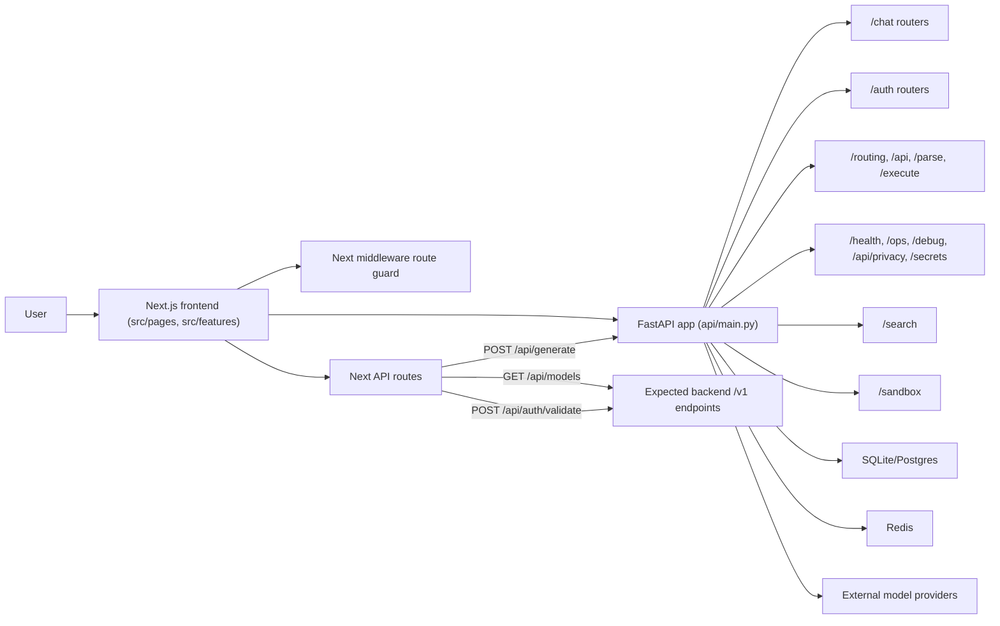

# Architecture Overview

Goblin Assistant is currently a two-part application:

- Next.js Pages Router frontend in `src/`
- FastAPI backend in `api/`

There is also a thin proxy layer in `src/pages/api/` for a few browser-safe backend calls.

## Topology

## Frontend Structure

Key frontend areas:

- Pages: `src/pages/`
- Feature modules: `src/features/`
- Auth state: `src/store/authStore.ts`
- Session persistence: `src/utils/auth-session.ts`
- Provider selection: `src/contexts/ProviderContext.tsx`
- Backend client code: `src/api/apiClient.ts` and `src/api/http-client.ts`

Protected routes are enforced in `middleware.ts`. The middleware uses cookie presence as a routing gate, while sensitive data still relies on JWT validation server-side.

## Backend Structure

The FastAPI app is assembled in `api/main.py` and includes routers for:

- `/auth`
- `/chat`
- `/routing`
- `/api`
- `/parse`
- `/execute`
- `/health`
- `/search`
- `/settings`
- `/sandbox`
- `/api/privacy`
- `/debug`
- `/ops`
- `/secrets`

Startup also initializes Redis cache, database setup, provider monitoring, secrets adapter setup, and artifact cleanup.

## Request Paths That Match Today

These flows line up in the checked-in code:

1. Chat thread management from the frontend to backend `/chat/conversations*`
2. Prompt submission through Next `/api/generate` to backend `/api/chat`
3. Backend health and OpenAPI docs directly from the FastAPI app

## Known Contract Mismatches

Several important frontend paths still assume versioned endpoints:

- auth calls expect `/v1/auth/*`
- provider registry expects `/v1/providers/models`
- search calls expect `/v1/search/*`
- sandbox calls expect `/v1/sandbox/*`
- account/support calls expect `/v1/account/*` and `/v1/support/message`

The checked-in FastAPI app does not mount those `/v1` aliases. That is the main architecture gap to understand before working on local integration bugs.
