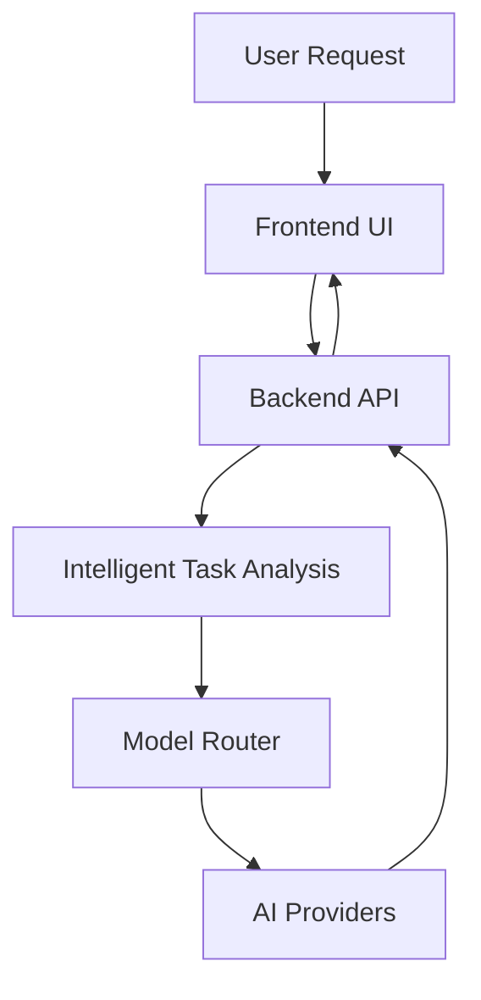

# Architecture

## System Architecture

GoblinOS Assistant follows a modular, microservices-inspired architecture designed for scalability, maintainability, and cost-efficiency. The system is built around intelligent model routing that automatically selects the most appropriate AI provider based on task complexity and requirements.

### Core Components

#### 🏗️ Backend API (`backend/`)

- **Framework**: FastAPI (Python async framework)
- **Purpose**: Main API service handling AI processing, model routing, and development assistance
- **Key Features**:
  - Intelligent model routing with automatic provider selection
  - RESTful API with automatic OpenAPI documentation
  - Async processing for high throughput
  - Comprehensive health monitoring and metrics

#### 🎨 Frontend UI (`app/`, `src/`)

- **Framework**: Next.js 14.2.15 with App Router + TypeScript
- **Purpose**: Modern web interface for AI assistant interactions
- **Key Features**:
  - Responsive design with accessibility support
  - Real-time streaming responses
  - Progressive Web App (PWA) capabilities
  - Component-based architecture

#### 🛠️ Infrastructure Layer

- **Primary CDN/Edge**: Cloudflare (Workers, KV, D1, R2, Tunnel, Turnstile)
- **Containerization**: Docker with multi-stage builds
- **Deployment**: Fly.io for backend, Vercel for frontend
- **Monitoring**: Sentry for error tracking, custom health endpoints

#### 💾 Data Layer

- **Database**: SQLite (development) / PostgreSQL (production)
- **Vector Store**: ChromaDB for semantic search and RAG
- **Caching**: Redis for session management and rate limiting
- **File Storage**: Cloudflare R2 for cost-effective object storage

### Request Flow Architecture



### Intelligent Model Routing

The core innovation of GoblinOS Assistant is its intelligent model routing system that automatically selects the most appropriate AI model based on:

- **Task Complexity**: Simple debugging → Raptor Mini; Complex reasoning → GPT-4/Claude
- **Cost Optimization**: Balances quality vs. cost for each request
- **Performance Requirements**: Latency-sensitive tasks get faster models
- **Provider Health**: Automatic failover and health monitoring

#### Routing Logic

```python
def route_request(task_complexity: str, cost_budget: float) -> str:
    """
    Intelligent routing based on task analysis
    """
    if task_complexity == "simple_debug":
        return "raptor-mini"  # Fast, cheap
    elif task_complexity == "complex_reasoning" and cost_budget > 0.10:
        return "gpt-4-turbo"  # High quality
    elif task_complexity == "creative_writing":
        return "claude-3-haiku"  # Creative tasks
    else:
        return "fallback_model"  # Cost-effective default
```

### Security Architecture

#### Authentication & Authorization
- **JWT-based authentication** with HttpOnly cookies
- **Passkey support** for passwordless authentication
- **Google OAuth integration** for social login
- **Role-based access control** (RBAC) for API endpoints

#### Data Protection
- **End-to-end encryption** for sensitive data
- **API key encryption** at rest using AES-256
- **TLS 1.3** for all communications
- **CSP headers** and XSS prevention

#### Bot Protection
- **Cloudflare Turnstile** integration for bot detection
- **Rate limiting** with Redis-backed storage
- **Request sanitization** and input validation

### Monitoring & Observability

#### Health Monitoring
- **Comprehensive health endpoints** (`/health`, `/v1/health/`)
- **Component-specific checks** (database, vector store, external services)
- **Performance metrics** (latency, throughput, error rates)

#### Error Tracking
- **Sentry integration** for real-time error monitoring
- **Structured logging** with correlation IDs
- **Custom metrics** for business logic monitoring

#### Analytics
- **PostHog integration** for user behavior analytics
- **Cost tracking** for API usage optimization
- **Performance dashboards** with historical data

### Deployment Architecture

#### Development Environment
- **Local development** with hot reload
- **Docker Compose** for multi-service setup
- **SQLite database** for quick iteration

#### Production Environment
- **Fly.io** for backend API (global deployment)
- **Vercel** for frontend (CDN distribution)
- **PostgreSQL** managed database
- **Redis** for caching and sessions
- **Cloudflare** for edge acceleration and security

### Scalability Considerations

#### Horizontal Scaling
- **Stateless backend** design for easy scaling
- **Redis-backed sessions** for distributed state
- **Load balancing** via Fly.io regions

#### Performance Optimization
- **Async processing** for I/O-bound operations
- **Connection pooling** for database and external APIs
- **Response caching** with TTL-based invalidation

#### Cost Optimization
- **Intelligent model selection** reduces API costs
- **Request batching** for similar operations
- **Caching layers** reduce redundant API calls

### Data Flow

#### User Request Processing
1. **Frontend** validates and sanitizes input
2. **Backend** analyzes task complexity and routes to appropriate model
3. **AI Provider** processes request and returns response
4. **Backend** processes and caches response
5. **Frontend** streams response to user with real-time updates

#### Background Processing
- **Task queues** for long-running operations
- **Scheduled jobs** for maintenance and cleanup
- **Event-driven processing** for real-time features

### API Design Principles

#### RESTful Design
- **Resource-based URLs** with consistent naming
- **HTTP methods** for CRUD operations
- **Status codes** for proper error handling
- **Versioning** via URL paths (`/v1/`)

#### Streaming Support
- **Server-sent events** for real-time responses
- **Chunked responses** for large data transfers
- **Connection management** with proper cleanup

#### Error Handling
- **Structured error responses** with error codes
- **User-friendly messages** without exposing internals
- **Logging** for debugging and monitoring

This architecture provides a solid foundation for a scalable, maintainable AI assistant platform that can grow with user needs while maintaining high performance and security standards.
