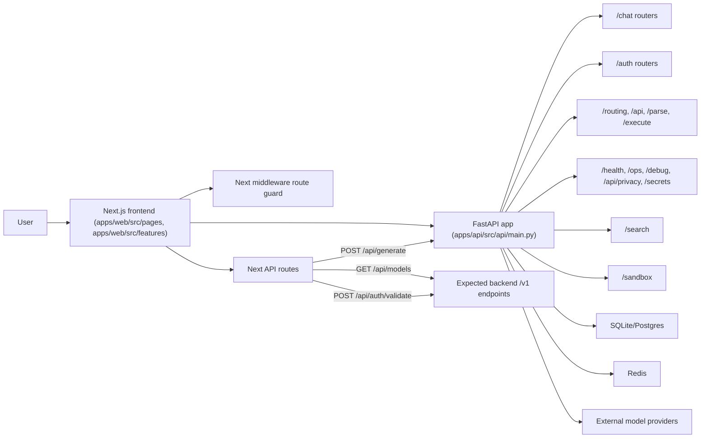

# Architecture Overview

Goblin Assistant is currently a two-part application:

- Next.js Pages Router frontend in `apps/web/src/`
- FastAPI backend in `api/`

There is also a thin proxy layer in `apps/web/pages/api/` for a few browser-safe backend calls.

## Topology

## Frontend Structure

Key frontend areas:

- Pages: `apps/web/pages/`
- Feature modules: `apps/web/src/features/`
- Auth state: `apps/web/src/store/authStore.ts`
- Session persistence: `apps/web/src/utils/auth-session.ts`
- Provider selection: `apps/web/src/contexts/ProviderContext.tsx`
- Backend client code: `apps/web/src/api/apiClient.ts` and `apps/web/src/api/http-client.ts`

Protected routes are enforced in `middleware.ts`. The middleware uses cookie presence as a routing gate, while sensitive data still relies on JWT validation server-side.

## Backend Structure

The FastAPI app is assembled in `apps/api/src/api/main.py` and includes routers for:

- `/auth`
- `/chat`
- `/routing`
- `/api`
- `/parse`
- `/execute`
- `/health`
- `/search`
- `/settings`
- `/sandbox`
- `/api/privacy`
- `/debug`
- `/ops`
- `/secrets`

Startup also initializes Redis cache, database setup, provider monitoring, secrets adapter setup, and artifact cleanup.

## Request Paths That Match Today

These flows line up in the checked-in code:

1. Chat thread management from the frontend to backend `/chat/conversations*`
2. Prompt submission through Next `/api/generate` to backend `/api/chat`
3. Backend health and OpenAPI docs directly from the FastAPI app

## API Versioning

All production routes are mounted exclusively under the `/api/v1` prefix via
`mount_versioned_primary_routes()` in `apps/api/src/api/route_mounting.py`.
A small set of internal/experimental routes (`semantic_chat`, debug, metrics)
remain at root with no versioned alias — these are not called by the frontend.

Frontend clients use `V1_API_PREFIX = '/api/v1'` and `V1_CHAT_PREFIX`
constants from `apps/web/src/lib/api/shared.ts` rather than hardcoding paths.
