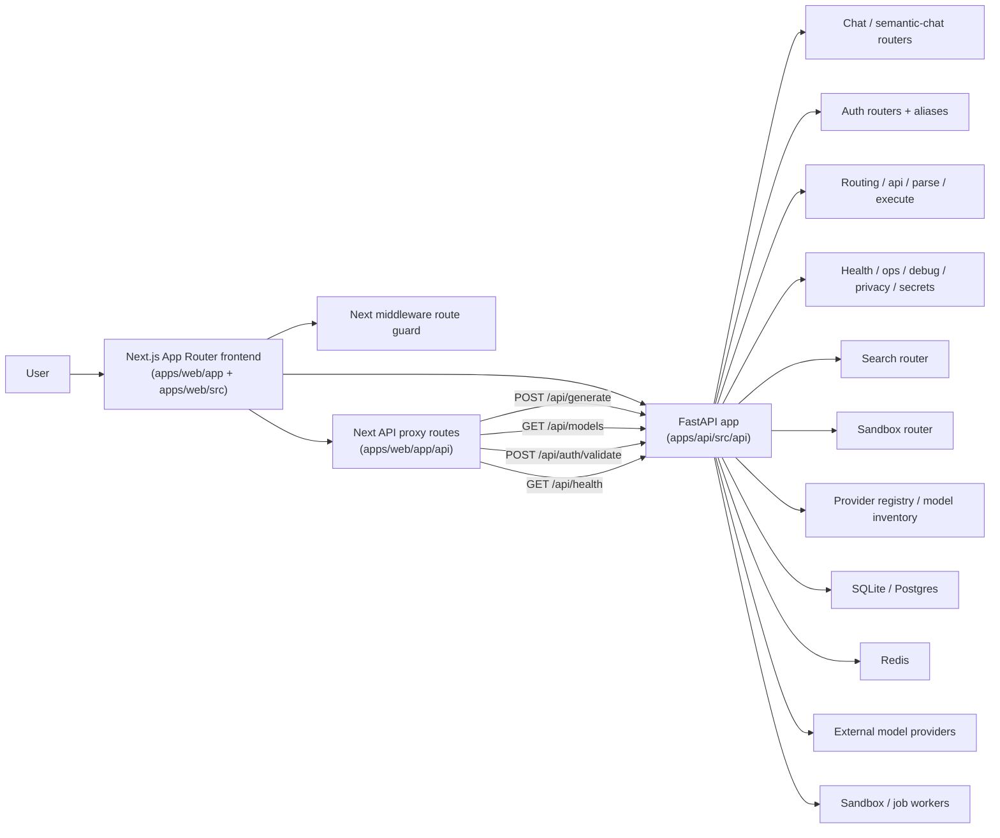

# Architecture Overview

Goblin Assistant is currently a hybrid App Router + FastAPI application:

- Next.js App Router frontend in `apps/web/app/`
- shared frontend modules, hooks, state, and SDK consumers in `apps/web/src/`
- thin same-origin proxy routes in `apps/web/app/api/`
- FastAPI backend in `apps/api/src/api/`

The routing and proxy split are documented in [ADR-0001](../decisions/2026-07-06-nextjs-app-router-over-pages-router.md) and [ADR-0003](../decisions/2026-07-06-nextjs-proxies-vs-direct.md).

The browser usually talks to the frontend shell first and then either uses a Next proxy route or calls the FastAPI app directly under `/api/v1/...`.

## Topology

```mermaid
graph LR
  U["User"] --> FE["Next.js App Router frontend<br/>(apps/web/app + apps/web/src)"]

  FE --> MW["Next middleware route guard"]
  FE --> NAPI["Next API proxy routes<br/>(apps/web/app/api)"]
  FE --> API["FastAPI app<br/>(apps/api/src/api)"]

  NAPI -->|"POST /api/generate"| API
  NAPI -->|"GET /api/models"| API
  NAPI -->|"POST /api/auth/validate"| API
  NAPI -->|"GET /api/health"| API

  API --> CHAT["Chat / semantic-chat routers"]
  API --> AUTH["Auth routers + aliases"]
  API --> ROUTING["Routing / api / parse / execute"]
  API --> OPS["Health / ops / debug / privacy / secrets"]
  API --> SEARCH["Search router"]
  API --> SANDBOX["Sandbox router"]
  API --> PROVIDERS["Provider registry / model inventory"]

  API --> DB["SQLite / Postgres"]
  API --> REDIS["Redis"]
  API --> PROVIDER_BACKENDS["External model providers"]
  API --> WORKERS["Sandbox / job workers"]
```

## Frontend Structure

Key frontend areas:

- App Router pages and layouts: `apps/web/app/`
- feature modules: `apps/web/src/features/`
- auth state: `apps/web/src/store/authStore.ts`
- session persistence: `apps/web/src/utils/auth-session.ts`
- provider selection: `apps/web/src/contexts/ProviderContext.tsx`
- backend client code: `apps/web/src/api/apiClient.ts` and `apps/web/src/api/http-client.ts`

Protected routes are enforced in `middleware.ts`. The middleware uses cookie presence as a routing gate, while sensitive data still relies on JWT validation server-side. The frontend may call the backend either through `app/api/*` proxies or directly through the configured backend origin.

## Backend Structure

The FastAPI app is assembled in `apps/api/src/api/main.py` and includes routers for:

- `/auth`
- `/chat`
- `/routing`
- `/api`
- `/parse`
- `/execute`
- `/health`
- `/search`
- `/settings`
- `/sandbox`
- `/api/privacy`
- `/debug`
- `/ops`
- `/secrets`

Startup also initializes Redis cache, database setup, provider monitoring, secrets adapter setup, and artifact cleanup.

## Request Paths That Match Today

These flows line up in the checked-in code:

1. Chat thread management from the frontend to backend `/api/v1/chat/conversations*`
2. Prompt submission through Next `/api/generate` to backend `/api/v1/api/chat`
3. Provider/model inventory through `/api/models` to backend `/api/v1/providers/models`
4. Backend health and OpenAPI docs directly from the FastAPI app

## API Versioning

Most production routes are mounted under the `/api/v1` prefix via
`mount_versioned_primary_routes()` in `apps/api/src/api/route_mounting.py`.
A few compatibility aliases also stay mounted without `/api/v1` so older callers
do not break during migration. The route manifest and OpenAPI export are both
checked in so contract drift can be detected in CI.

The canonical contract snapshots are `packages/sdk/openapi/openapi.json` and
`packages/sdk/openapi/routes.json`. CI regenerates them, diffs them against the
checked-in copies, and also validates frontend API path usage against the
manifest.

The versioning rationale lives in [ADR-0002](../decisions/2026-07-06-api-versioning-v1-contract.md).

Frontend clients use `V1_API_PREFIX = '/api/v1'` and `V1_CHAT_PREFIX`
constants from `apps/web/src/lib/api/shared.ts` rather than hardcoding paths.
