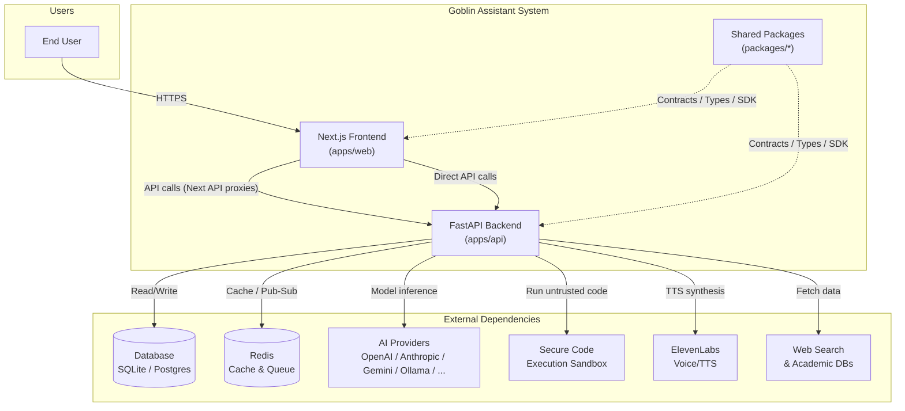
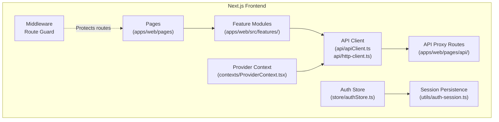
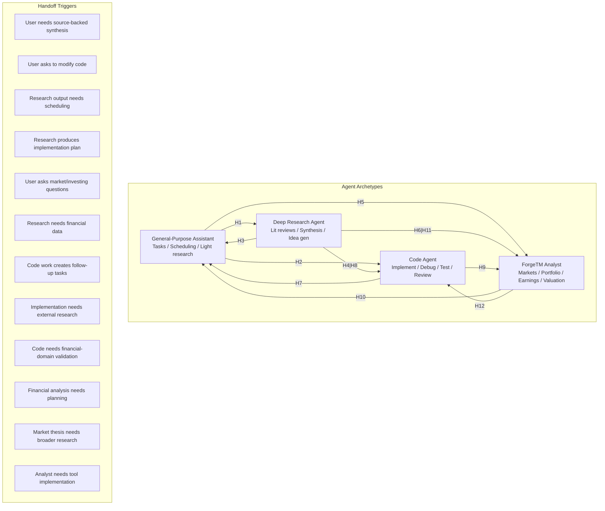
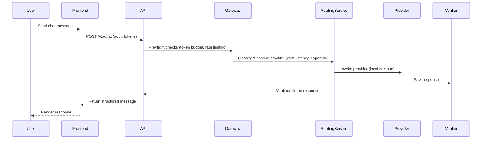
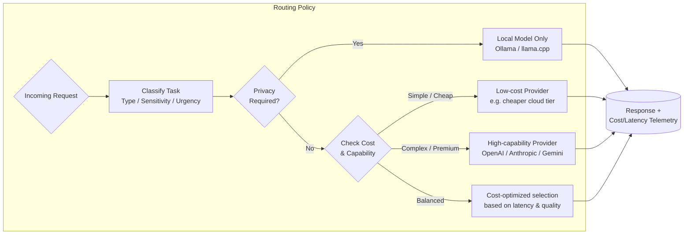
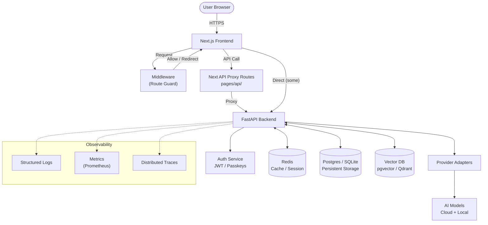
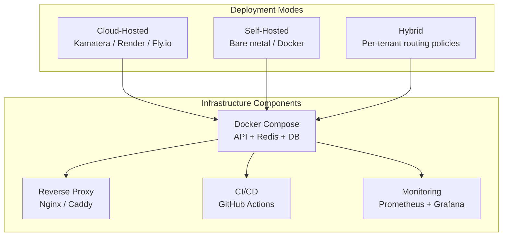
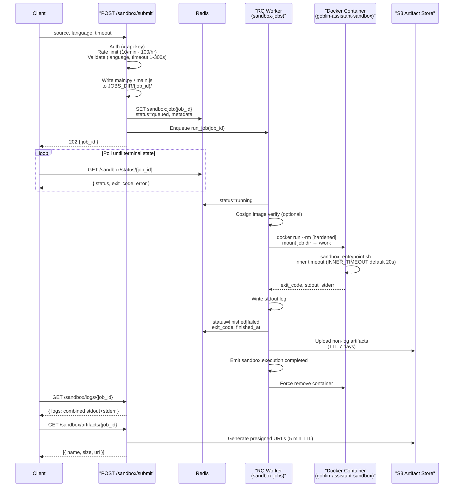
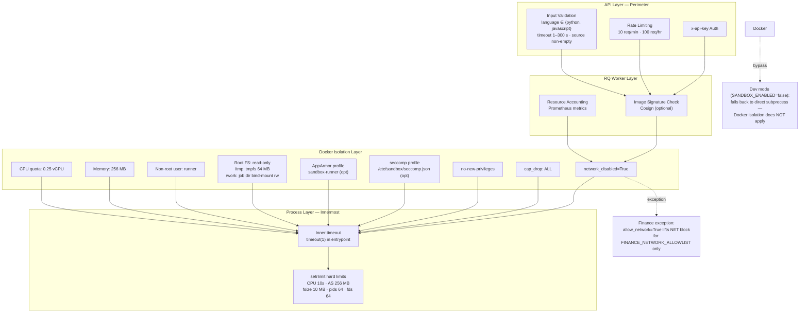

# Goblin Assistant — Architecture Diagrams

## 1. System Context (C4 — Level 1)

## 2. Container Diagram — Frontend

## 3. Container Diagram — Backend (FastAPI)

```mermaid
graph TB
  subgraph "FastAPI Application (apps/api/src/api/main.py)"
    GATEWAY["API Gateway<br/>Request Pre-processing<br/>Auth / Rate-limit / CORS"]
    ROUTER_CHAT["/chat<br/>Conversation management"]
    ROUTER_AUTH["/auth<br/>JWT / Passkeys"]
    ROUTER_ROUTING["/routing<br/>Provider dispatch"]
    ROUTER_API["/api<br/>General endpoints"]
    ROUTER_PARSE["/parse<br/>Document parsing"]
    ROUTER_EXECUTE["/execute<br/>Action execution"]
    ROUTER_HEALTH["/health<br/>Health checks"]
    ROUTER_SEARCH["/search<br/>Search & retrieval"]
    ROUTER_SETTINGS["/settings<br/>User config"]
    ROUTER_SANDBOX["/sandbox<br/>Code sandbox"]
    ROUTER_PRIVACY["/api/privacy"]
    ROUTER_DEBUG["/debug"]
    ROUTER_OPS["/ops"]
    ROUTER_SECRETS["/secrets"]
  end

  subgraph "Services Layer"
    ORCHESTRATOR["Provider Orchestrator<br/>Model routing & dispatch"]
    RAG_ENGINE["RAG Engine<br/>Raptor-backed retrieval"]
    VECTOR_DB["Vector DB<br/>pgvector / Qdrant / Chroma"]
    TASK_QUEUE["Task Queue<br/>Redis / Celery"]
    COST_TRACKER["Cost & Latency<br/>Tracker"]
  end

  subgraph "Adapters"
    ADAPTER_CLOUD["Cloud Provider Adapters<br/>OpenAI / Anthropic / Gemini / ..."]
    ADAPTER_LOCAL["Local Model Adapters<br/>Ollama / llama.cpp"]
    ADAPTER_STORAGE["Storage Adapter<br/>Files / S3-compatible"]
  end

  GATEWAY --> ROUTER_CHAT
  GATEWAY --> ROUTER_AUTH
  GATEWAY --> ROUTER_ROUTING
  GATEWAY --> ROUTER_API
  GATEWAY --> ROUTER_PARSE
  GATEWAY --> ROUTER_EXECUTE
  GATEWAY --> ROUTER_HEALTH
  GATEWAY --> ROUTER_SEARCH
  GATEWAY --> ROUTER_SETTINGS
  GATEWAY --> ROUTER_SANDBOX
  GATEWAY --> ROUTER_PRIVACY
  GATEWAY --> ROUTER_DEBUG
  GATEWAY --> ROUTER_OPS
  GATEWAY --> ROUTER_SECRETS

  ROUTER_CHAT --> ORCHESTRATOR
  ROUTER_ROUTING --> ORCHESTRATOR
  ROUTER_API --> ORCHESTRATOR
  ROUTER_SEARCH --> RAG_ENGINE
  ROUTER_SANDBOX --> TASK_QUEUE

  ORCHESTRATOR --> ADAPTER_CLOUD
  ORCHESTRATOR --> ADAPTER_LOCAL
  ORCHESTRATOR --> COST_TRACKER
  RAG_ENGINE --> VECTOR_DB
  RAG_ENGINE --> ADAPTER_STORAGE
```

## 4. Agent Archetypes & Handoffs

## 5. Request Routing Sequence

## 6. Hybrid Provider Routing Decision

## 7. Data Flow — Full Stack

## 8. Deployment Options

## 9. Sandbox Execution Lifecycle

## 10. Sandbox Security Boundary

