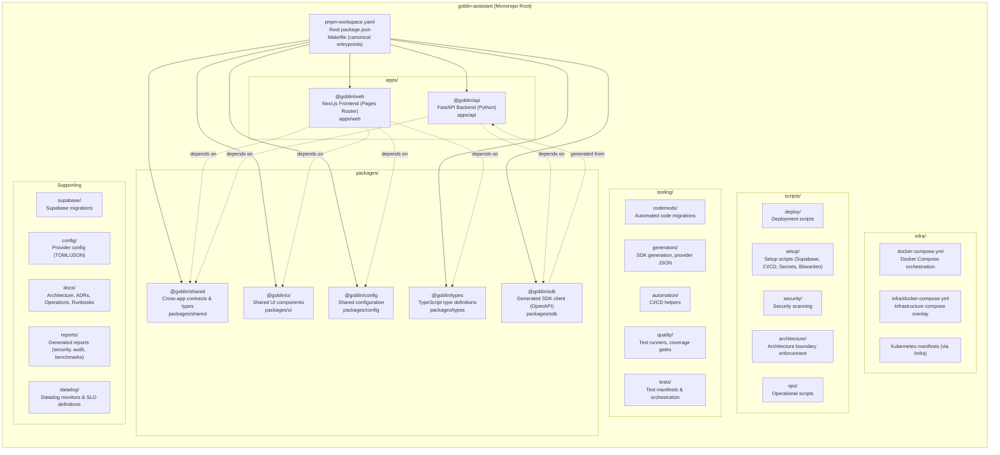
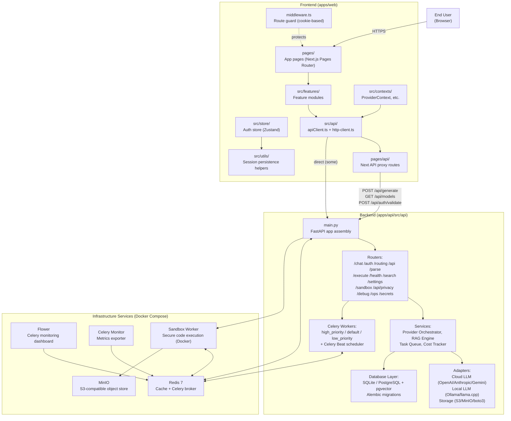
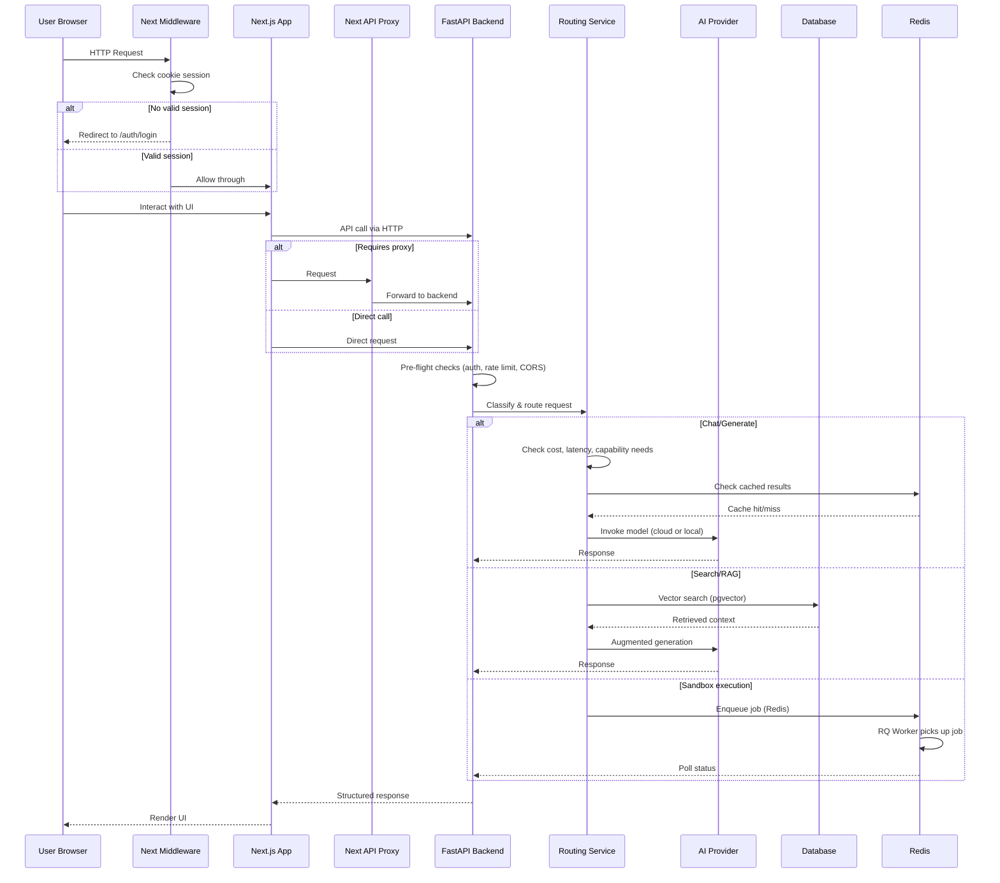
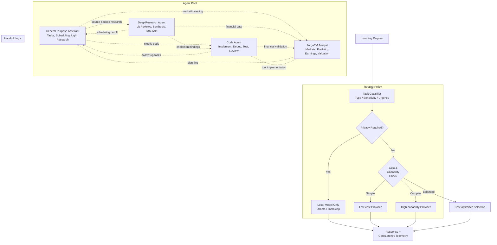
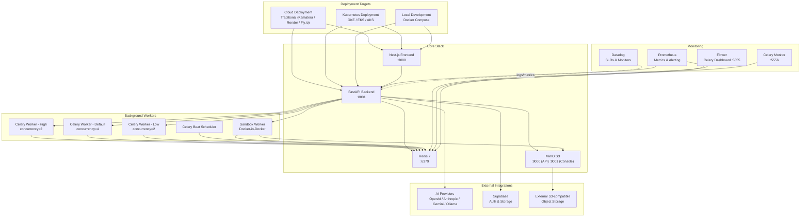
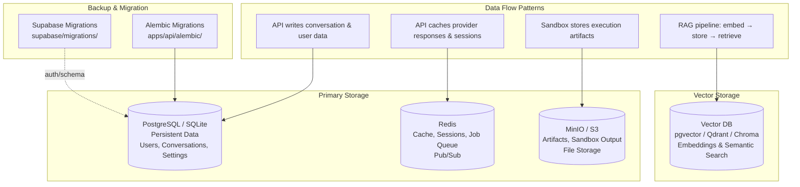
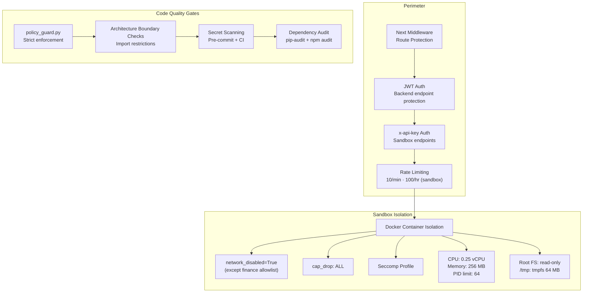

# Goblin Assistant — Workspace Architecture Diagram

## 1. Monorepo Workspace Topology (pnpm Workspace)



## 2. Application Layer — Frontend + Backend Zoom



## 3. Request Flow — End-to-End



## 4. Agent Archetype Handoffs & Routing



## 5. Infrastructure & Deployment Topology



## 6. CI/CD Pipeline

```mermaid
graph LR
    subgraph "CI (GitHub Actions)"
        CHECKOUT["Checkout"]
        INSTALL["Install Dependencies<br/>pnpm install + pip install"]
        LINT["Lint & Format Check<br/>pnpm lint + Ruff + policy_guard"]
        TYPE_CHECK["Type Check<br/>TypeScript + mypy + pyright"]
        TEST["Test Suite<br/>Unit / Integration / Contract / E2E"]
        BUILD["Build<br/>Next.js build + SDK generation"]
        BOUNDARY["Boundary Checks<br/>Architecture + Capability + Cycles"]
        SECURITY["Security Scan<br/>Secret scan + Dependency audit"]
    end

    subgraph "CD (Deployment)"
        DEPLOY_PREVIEW["Deploy Preview<br/>Vercel (frontend)"]
        DEPLOY_STAGING["Deploy Staging<br/>Docker Compose / K8s"]
        DEPLOY_PROD["Deploy Production<br/>Docker Compose / K8s"]
        HEALTH_CHECK["Health Check<br/>curl /health"]
        SMOKE_TEST["Smoke Tests<br/>E2E against deployed target"]
    end

    CHECKOUT --> INSTALL
    INSTALL --> LINT
    INSTALL --> TYPE_CHECK
    LINT --> TEST
    TYPE_CHECK --> TEST
    TEST --> BUILD
    TEST --> BOUNDARY
    BUILD --> SECURITY
    BOUNDARY --> SECURITY

    SECURITY --> DEPLOY_PREVIEW
    SECURITY --> DEPLOY_STAGING
    DEPLOY_STAGING --> HEALTH_CHECK
    HEALTH_CHECK --> SMOKE_TEST
    SMOKE_TEST --> DEPLOY_PROD
```



## 7. Data & Storage Architecture



## 8. Security Boundaries



## 9. Directory Tree (Canonical Source Map)

```
goblin-assistant/
├── apps/                                 # Application code
│   ├── web/                              # Next.js frontend (TypeScript)
│   │   ├── pages/                        # Pages Router pages
│   │   │   └── api/                      # Next API proxy routes
│   │   ├── src/                          # Source code
│   │   │   ├── api/                      # API client code
│   │   │   ├── contexts/                 # React contexts
│   │   │   ├── features/                 # Feature modules
│   │   │   ├── store/                    # State management
│   │   │   └── utils/                    # Utilities
│   │   ├── e2e/                          # Playwright E2E tests
│   │   ├── tests/                        # Unit/integration tests
│   │   ├── public/                       # Static assets
│   │   └── config/                       # Jest, Playwright config
│   └── api/                              # FastAPI backend (Python)
│       ├── src/api/                      # FastAPI app source
│       │   ├── routers/                  # Route handlers
│       │   ├── services/                 # Business logic
│       │   └── adapters/                 # External integrations
│       ├── alembic/                      # DB migrations
│       ├── scripts/                      # Backend utility scripts
│       └── tests/                        # Pytest suite
├── packages/                             # Shared code
│   ├── shared/                           # Cross-app contracts & types
│   ├── ui/                               # Shared UI components
│   ├── config/                           # Shared configuration
│   ├── types/                            # TypeScript definitions
│   └── sdk/                              # Generated SDK client
├── docker/                               # Dockerfiles
│   └── sandbox/                          # Sandbox container
├── infra/                                # Infrastructure configs
├── scripts/                              # Repository scripts
│   ├── deploy/                           # Deployment automation
│   ├── setup/                            # Environment setup
│   ├── security/                         # Security tooling
│   ├── architecture/                     # Boundary enforcement
│   └── ops/                              # Operational scripts
├── tooling/                              # Development tooling
│   ├── codemods/                         # Automated refactoring
│   ├── generators/                       # Code generation
│   ├── automation/                       # CI helpers
│   └── quality/                          # Quality gates
├── tests/                                # Cross-cutting tests
│   ├── integration/                      # Integration tests
│   ├── contract/                         # Contract tests
│   ├── e2e/                              # E2E tests
│   └── performance/                      # Performance tests
├── docs/                                 # Documentation
│   ├── architecture/                     # Architecture docs
│   ├── adr/                              # Decision records
│   ├── backend/                          # Backend docs
│   ├── frontend/                         # Frontend docs
│   ├── operations/                       # Operational docs
│   ├── runbooks/                         # Incident runbooks
│   ├── security/                         # Security docs
│   └── decisions/                        # Architecture decisions
├── supabase/                             # Supabase migrations
├── config/                               # Provider configs
├── docker-compose.yml                    # Docker orchestration
├── docker-compose.redis.yml              # Redis-only compose
├── render.yaml                           # Render deployment
├── Makefile                              # Canonical entrypoints
├── pnpm-workspace.yaml                   # Workspace definition
└── package.json                          # Root package